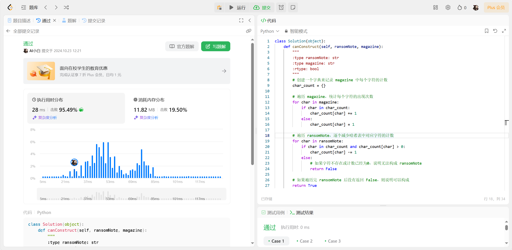
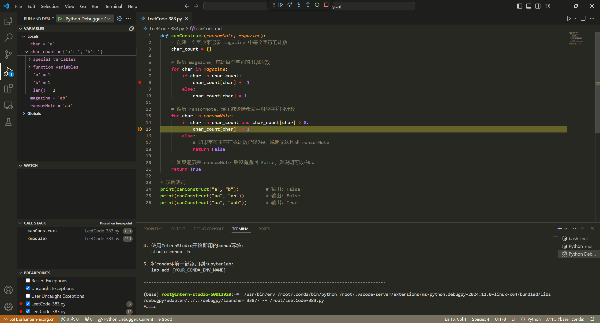

### 任务一

```
def canConstruct(ransomNote, magazine):  
    # 创建一个字典来记录 magazine 中每个字符的计数  
    char_count = {}  
      
    # 遍历 magazine，统计每个字符的出现次数  
    for char in magazine:  
        if char in char_count:  
            char_count[char] += 1  
        else:  
            char_count[char] = 1  
      
    # 遍历 ransomNote，逐个减少哈希表中对应字符的计数  
    for char in ransomNote:  
        if char in char_count and char_count[char] > 0:  
            char_count[char] -= 1  
        else:  
            # 如果字符不存在或计数已经为0，说明无法构成 ransomNote  
            return False  
      
    # 如果遍历完 ransomNote 后没有返回 False，则说明可以构成  
    return True  
  
# 示例测试  
print(canConstruct("a", "b"))          # 输出: False  
print(canConstruct("aa", "ab"))        # 输出: False  
print(canConstruct("aa", "aab"))       # 输出: True
```


### 任务二

#### VSCode Debug 笔记
今天成功利用VSCode的调试功能完成了一次代码调试。整个过程流畅且高效，让我深刻体会到了IDE（集成开发环境）在软件开发中的重要作用。

我通过点击VSCode侧边栏的“运行和调试”图标，或者直接使用快捷键F5，启动了调试会话。VSCode自动在launch.json文件中读取了我的调试配置，包括启动程序、端口号（如果是Web应用）以及任何特定的环境变量等。

在调试过程中，我利用了断点（Breakpoints）来暂停代码执行，这样我可以逐步查看变量的值、调用栈以及代码的执行流程。通过“步进”（Step Over）、“跳入”（Step Into）和“跳出”（Step Out）等调试操作，我能够精确地控制代码的执行，快速定位问题所在。