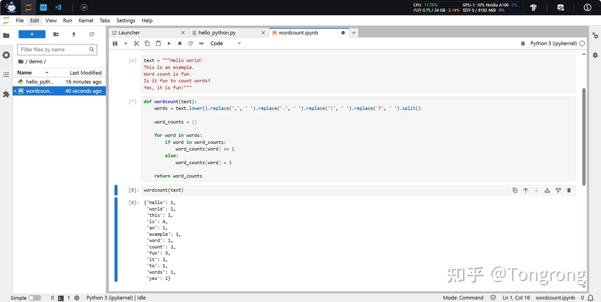
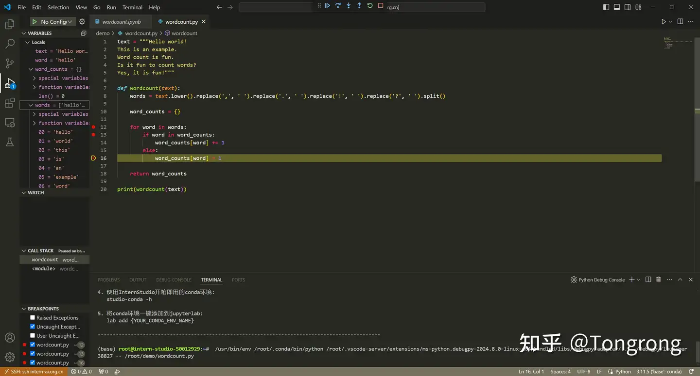

### 任务一

### 任务二

#### VSCode Debug 笔记
今天，我成功利用VSCode的调试功能完成了一次代码调试。整个过程流畅且高效，让我深刻体会到了IDE（集成开发环境）在软件开发中的重要作用。

我通过点击VSCode侧边栏的“运行和调试”图标，或者直接使用快捷键F5，启动了调试会话。VSCode自动在launch.json文件中读取了我的调试配置，包括启动程序、端口号（如果是Web应用）以及任何特定的环境变量等。

在调试过程中，我利用了断点（Breakpoints）来暂停代码执行，这样我可以逐步查看变量的值、调用栈以及代码的执行流程。通过“步进”（Step Over）、“跳入”（Step Into）和“跳出”（Step Out）等调试操作，我能够精确地控制代码的执行，快速定位问题所在。

备注：图片带有知乎账号的水印是因为最开始想用知乎交作业，后来想着既然要做项目，就全放在GitHub上，所以这里图片是直接从本人的知乎账号已经写好的作业中复制过来的。